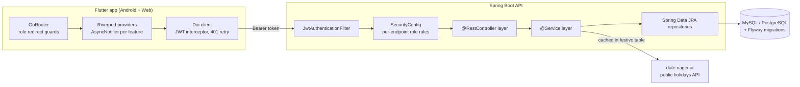

# Architecture

Two deployables: a stateless Spring Boot API and a Flutter client. They only talk over
`/api/**` (JSON) and `/uploads/**` (avatar images).



## Request path (backend)

1. `JwtAuthenticationFilter` reads the `Authorization: Bearer` header, validates the token with
   `JwtTokenProvider`, checks it against `TokenBlacklist` (populated on logout), and sets the
   `SecurityContext`.
2. `SecurityConfig` applies the rule table — session policy is `STATELESS`, CSRF disabled, CORS
   scoped to `/api/**`. Rules are per path **and** per HTTP method, e.g. any authenticated user
   can `GET /api/alumnos/**` but only `ADMIN` can write.
3. Controller → service (`*ServiceImpl`) → JPA repository. DTOs (`dto/`, `domain/`) cross the
   controller boundary; entities never leave the service layer.
4. `GlobalExceptionHandler` maps `ResourceNotFoundException` and validation errors to structured
   JSON.

Cross-cutting: `RateLimitFilter` (per-IP request cap), `FileStorageService` (avatar uploads to
a local directory served at `/uploads/**`), `DatabaseInitializer` / `FlywayRepairConfig` (schema
lifecycle), `Auditoria` entity written on sensitive changes.

## Auth flow

```
POST /api/auth/login  {username, password}
  → AuthService: bcrypt check, issue JWT (24h)
  → LoginResponse {token, role, profile}
client stores token in secure storage, Dio attaches it to every request
POST /api/auth/logout → token added to TokenBlacklist
```

Password reset uses a short-lived `PasswordResetToken` entity.

## Frontend structure

Feature-first. Each `lib/features/<x>/` owns its screens, its Riverpod providers and its data
layer; `lib/core/` holds the Dio client, secure storage and constants; `lib/shared/` holds
theme, reusable widgets and the generated l10n (`ES` / `CA` / `EN`, switched at runtime).

- **State**: Riverpod 2 with code generation. API-backed state is an `AsyncNotifier` so every
  screen gets loading / data / error for free.
- **Navigation**: GoRouter with a `redirect` that bounces users away from routes their role
  can't reach — the same rule set the backend enforces.
- **HTTP**: Dio with interceptors — one injects the JWT, one catches `401` and routes to login.

## Data model (core entities)

`Alumno`, `Profesor` (both carry a role), `Curso` ← `Materia`, `Clase`, `Horario` ←
`FranjaHoraria`, `Asistencia` (attendance rows), `Incidencia`, `Evento`, `Festivo` (holiday
cache), `AnioEscolar`, `Reglamento`, plus `CursoPlantilla` / `MateriaPlantilla` (templates an
admin instantiates for a new year), `Auditoria`, `ConfiguracionSistema`, `PasswordResetToken`.

## External services

Only [date.nager.at](https://date.nager.at) for public holidays, and its results are cached in
the `festivo` table so the app works offline after the first fetch. No payment, email or
analytics integrations.

## Deployment notes

The backend is deploy-ready: every credential is an environment variable (`DB_URL`,
`DB_USERNAME`, `DB_PASSWORD`, `GAULA_JWT_SECRET`, `CORS_ALLOWED_ORIGINS`) with no repo defaults
for the `prod` profile. The Flutter web build is static output — host it anywhere and point
`API_BASE_URL` at the deployed API.
