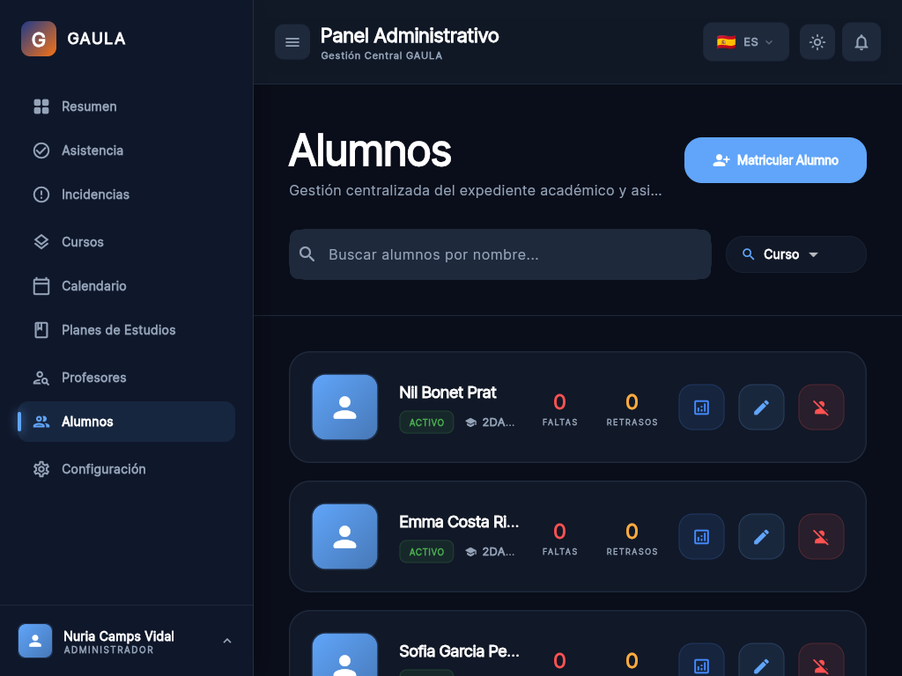
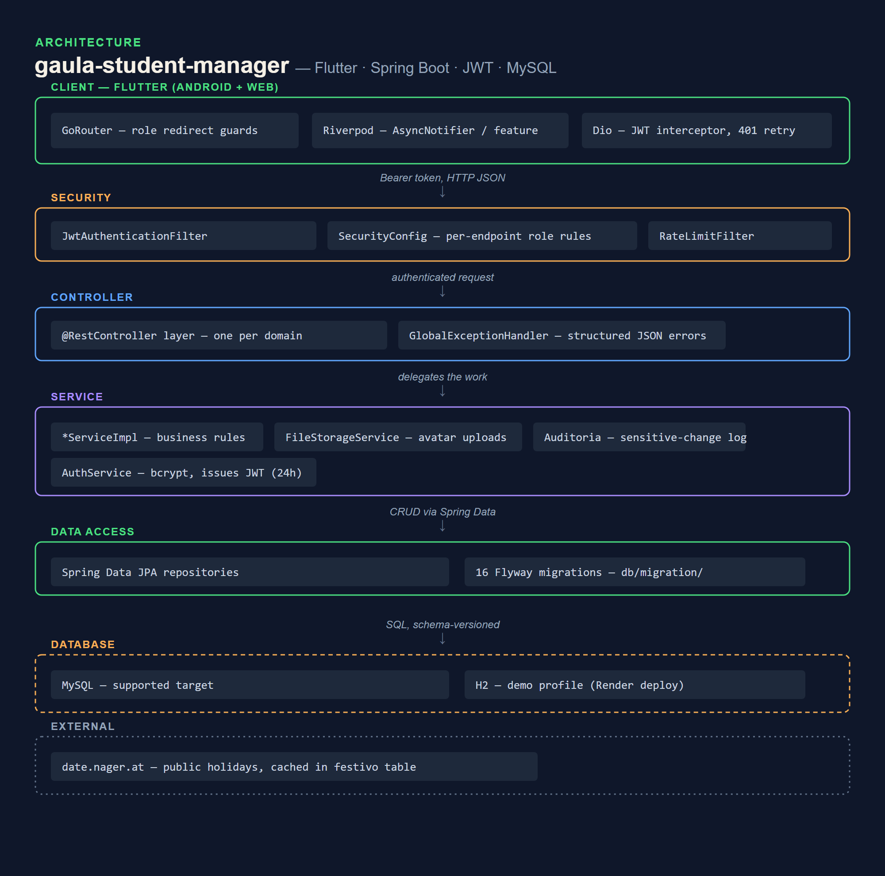

# GAULA — school management platform


A full-stack platform for running a school: students, teachers, courses, class schedules,
attendance ("pasar lista"), incident reports, events and a holiday calendar. A **Spring Boot**
REST API with JWT auth and a **Flutter** client that runs on Android and the web from one
codebase.

Built for the final DAM (software development) project. Two people, ~130 backend classes and a
feature-first Flutter app.

## Live demo

There is a `demo` profile that runs the entire backend with no database and no setup — H2 in
memory, re-seeded on every start with a small fictional school (four teachers, two DAM groups,
nine students, a weekly timetable). Password is role-based: `admin`/`admin123` for the full
admin view, any teacher username (`ifernandez`, `jpuig`, `msoler`) + `teacher123` for the
teacher view, or any student username (`clopez`, `sgarcia`, `mroca`, ...) + `student123` for
the student view.

```bash
cd Backend
GAULA_JWT_SECRET=local-dev-secret ./mvnw spring-boot:run -Dspring-boot.run.profiles=demo
```

**Live:** [web client](https://presidenteog.github.io/gaula-student-manager/) (Flutter,
GitHub Pages, prefilled `admin`/`admin123`) · [API docs](https://gaula-student-manager.onrender.com/v3/api-docs)
(Render free tier — sleeps after ~15 min idle, first hit takes ~30–60s to wake, and every
sleep/deploy resets the in-memory demo data back to the seed).

Hosting details (Render for the API, GitHub Pages for the Flutter web client): [DEPLOY.md](DEPLOY.md).

## The three roles

| Role | Can do |
|---|---|
| **Admin** | Everything — create courses/subjects from templates, enrol students, assign teachers, edit the school year, manage the rulebook and system config. |
| **Teacher** | See their classes and schedule, take attendance, open incident reports, read the directory. |
| **Student** | See their timetable, attendance record, incidents, events and the school rulebook. |

Access is enforced server-side in `SecurityConfig` (per-endpoint, per-HTTP-method role checks)
and mirrored in the Flutter router as redirect guards.

## Repository layout

```
Backend/    Spring Boot REST API
  src/main/java/com/gaula/
    controller/  service/  repository/  entity/  dto/  domain/
    security/    JWT filter, token provider, blacklist (logout), UserDetails
    config/      Spring Security, CORS, rate limiting, Flyway, DB seeding
  src/main/resources/db/migration/   Flyway migrations (V1..V16)
Frontend/   Flutter app (mobile-first, also web)
  lib/
    features/{auth,admin,teacher,student,attendance,shared}/
    core/{network,storage,constants}/   Dio client + JWT interceptor, secure storage
    router/     GoRouter with role-based redirects
    shared/     theme, widgets, providers, l10n (ES / CA / EN)
```

## Run it locally

**Backend** — needs JDK 21 and a MySQL database (or Postgres — both drivers are on the
classpath). Nothing is hardcoded; configuration is all environment variables:

```bash
cd Backend
export DB_URL="jdbc:mysql://localhost:3306/gaula?useSSL=false&allowPublicKeyRetrieval=true"
export DB_USERNAME=root DB_PASSWORD=yourpassword
export GAULA_JWT_SECRET="$(openssl rand -base64 64)"
mvn spring-boot:run
```

Flyway creates the schema and seeds demo data on first boot. Swagger UI is at
`http://localhost:8080/swagger-ui.html`. Seeded logins use the password `admin123` (see
`db/migration/V2__fix_default_passwords.sql`).

**Frontend** — needs the Flutter SDK (3.22+):

```bash
cd Frontend
flutter pub get
flutter run --dart-define-from-file=env/dev.json          # mobile
flutter run -d chrome --dart-define-from-file=env/dev.json # web
```

`env/dev.json` points at `http://localhost:8080`. `env/prod.json` targets a deployed backend —
edit its URLs, or let the Pages workflow fill them from the `API_BASE_URL` repo variable.

To run the backend with **no database at all**, use the `demo` profile (see [Live demo](#live-demo)).

## Screenshots

The real Flutter web client, live on GitHub Pages, logged in as the seeded admin —
not just the API docs.


:---:
Student roster (`Alumnos`), seeded fictional school — nine students across two DAM groups

## Architecture



See [ARCHITECTURE.md](./ARCHITECTURE.md) for the request path, the auth flow and the data model.

## Contributors

Built by two students on the DAM course. Handles are GitLab, where the coursework was hosted.

- **Ismael Rosillo** (@rosillodev)
- **Daniel Adanegbe** (@dadanegbe)

## License

PolyForm Noncommercial 1.0.0 ([LICENSE](./LICENSE)). Personal, non-commercial use only.
